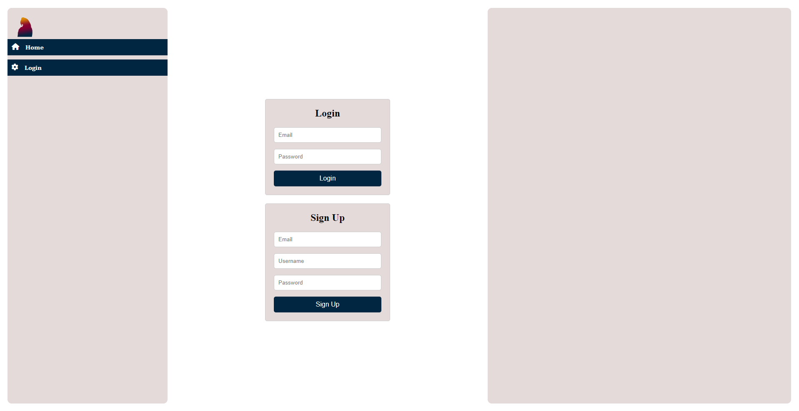
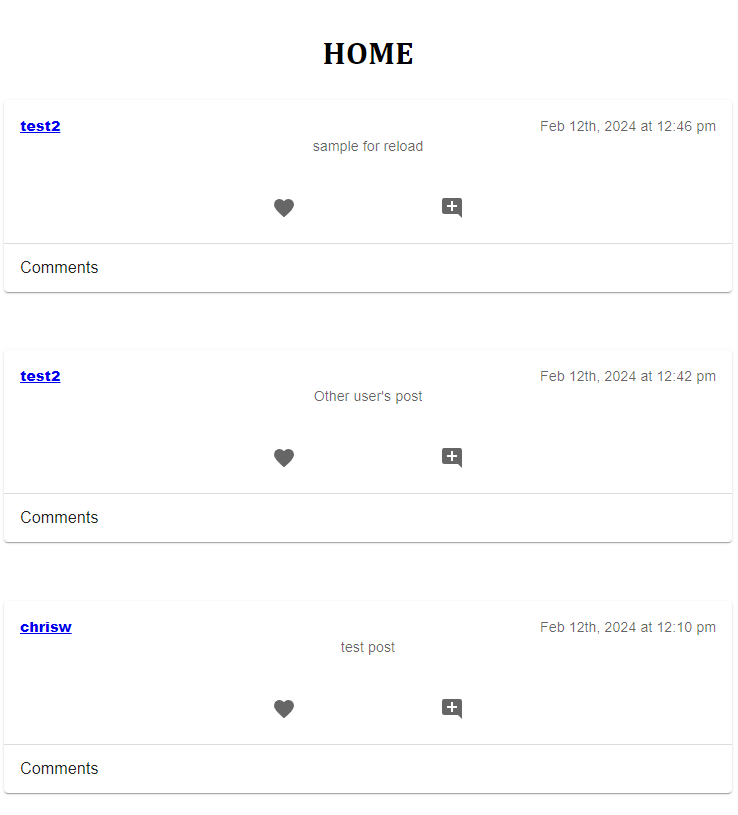
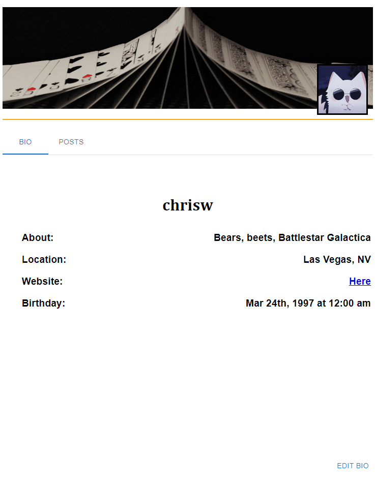

# Parrot (A social media application)

## Description

Parrot is a social media application that allows user's to post their thoughts, comment on other's posts, and customize their own profile. The purpose of this project was to learn how to build a MERN stack application that demonstrates a fundamental understanding in concepts in both the front-end and back-end. The motivation for building the application was to solidify technical skills in programming utilies such as React, MongoDB/Mongoose, Apollo Server with GraphQL, and Materialize UI. 

## Installation

N/A

## Usage

As this project is a full-stack application, client's will have full functionality through the deployed URL provided down below. Users will be prompted to either sign up or login upon reaching the landing page before they are redirected and gain access to features on the home page and profile page. To create a post, click on the plus button on the bottom right side of the window on the home page where users will be directed to a post creation form. The profile allows users to add a custom profile picture in addition to a profile banner. There, users can use the profile tabs to navigate between their bio, posts, and comments. In the bio tab, clients may write about themselves, share their location, link their website, and show their birthday. The "posts" tab will display posts that the user  has contributed to the website. 

## Credits

React JavaScript library for developing a majority of the front-end functionality of the application. MongoDB and Mongoose for providing a database and data modeling library used on the back-end programming. Apollo Server for hosting APIs; GraphQL for providing a runtime engine used in data queries/maniuplations. Materialize UI for their fron-end framework used to create a modern design throughout the application. Diarmuid Murphy and Megan Meyer for continued guidance and assitance through the duration of developing the application and features. 

## Link(s)

## Image(s)

